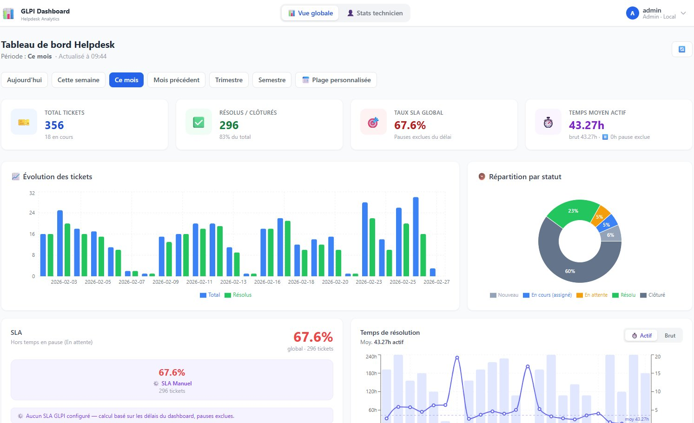
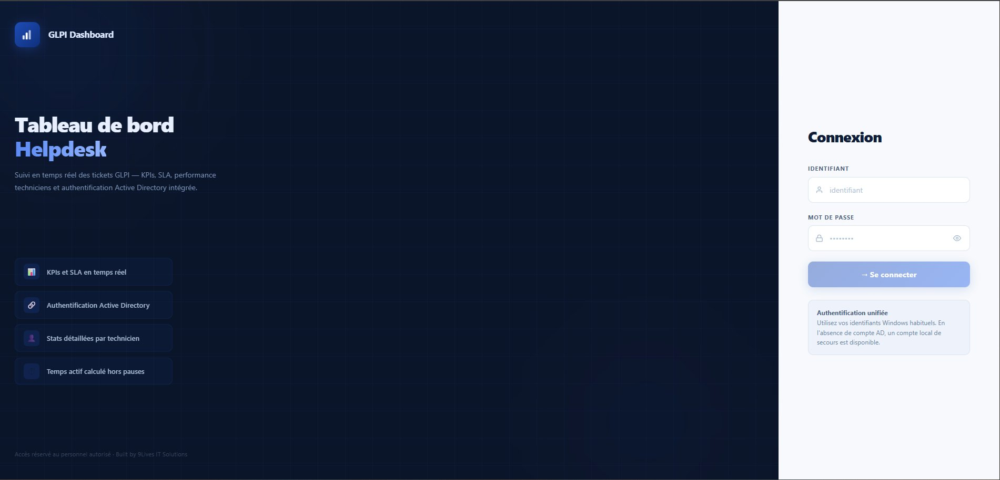

# glpi-dashboard

> Tableau de bord helpdesk pour GLPI 10.x — KPIs, SLA, stats techniciens, authentification LDAP/AD


[English version](README.md)

---

## Aperçu

### Tableau de bord


### Page de connexion


---

## Fonctionnalités

### Dashboard global
- **KPIs** : total tickets, résolus/clôturés, taux SLA global, temps moyen de résolution
- **Évolution temporelle** : volume par jour/semaine/mois (bar chart)
- **Répartition par statut** : donut chart interactif
- **SLA par priorité** : progress bars avec délais configurables
- **Charge technicien/groupe** : horizontal bar chart comparatif

### Stats par technicien
- Sélecteur avec recherche dans la liste
- KPIs individuels + comparaison vs moyenne équipe
- Évolution activité, répartition statuts/priorités, top catégories traitées

### Périodes disponibles
`Aujourd'hui` · `Cette semaine` · `Ce mois` · `Mois précédent` · `Trimestre` · `Semestre` · `Plage personnalisée`

### Authentification
- **Local** : bcrypt 12 rounds + JWT 8h
- **Active Directory** : bind via `userPrincipalName` ou `DOMAIN\username`
- **OpenLDAP** : `member` / `memberUid` / `uniqueMember`
- **Groupes d'accès** : mapping groupe LDAP → rôle `admin`/`viewer`, recalculé à chaque connexion

---

## Architecture

```
┌─────────────────────────────────────────────────────┐
│  Browser — http://IP                                │
│  React 18 + Recharts + Tailwind CSS                 │
└────────────────────┬────────────────────────────────┘
                     │ /api/* (proxy nginx)
┌────────────────────▼────────────────────────────────┐
│  Node.js 20 / Express — port 4000                   │
│  JWT · bcrypt · ldapjs                              │
└────────┬────────────────────┬───────────────────────┘
         │                    │
┌────────▼──────┐    ┌────────▼──────────────────────┐
│  MySQL :3307  │    │  MySQL GLPI existant           │
│  app_config   │    │  ⚠️  LECTURE SEULE             │
│  app_users    │    │  glpi_tickets + users + groups │
└───────────────┘    └────────────────────────────────┘
```

> La base GLPI n'est **jamais modifiée** — accès en lecture seule uniquement.

---

## Prérequis

| Composant | Version minimale |
|---|---|
| Docker | 24+ |
| Docker Compose v2 | `docker compose` (plugin) |
| MySQL / MariaDB | Serveur GLPI accessible en réseau |

---

## Installation

### 1. Cloner le dépôt

```bash
git clone https://github.com/9LivesITSolutions/glpi-dashboard.git
cd glpi-dashboard
```

### 2. Créer le fichier `.env`

```bash
cp .env.example .env
```

Remplir les valeurs dans `.env` :

```env
# Générer avec : openssl rand -hex 32
JWT_SECRET=<votre_secret_aleatoire>

DB_ROOT_PASSWORD=<mot_de_passe_root_mysql>
APP_DB_USER=dashboard_user
APP_DB_PASSWORD=<mot_de_passe_app>

FRONTEND_PORT=80
```

> **Attention :** Ne jamais commiter le fichier `.env` — il est dans `.gitignore`.

### 3. Lancer les conteneurs

```bash
docker compose up -d --build
```

| Conteneur | Port exposé | Rôle |
|---|---|---|
| `glpi_dashboard_front` | **80** (configurable) | Interface web |
| `glpi_dashboard_api` | 4000 (interne) | API REST |
| `glpi_dashboard_db` | 3307 (local) | MySQL app |

### 4. Vérifier le démarrage

```bash
docker compose ps
docker compose logs backend --tail=20
```

Attendu :
```
✅ Bootstrap DB effectué.
🚀 GLPI Dashboard API démarré sur http://localhost:4000
```

### 5. Accéder à l'interface

**http://[IP-SERVEUR]** → le wizard de configuration s'affiche automatiquement au premier lancement.

---

## Configuration initiale — Wizard

### Étape 1 — Base de données GLPI

Créer un utilisateur MySQL **lecture seule** sur le serveur GLPI :

```sql
-- MySQL 8.0+ (deux commandes séparées)
CREATE USER 'glpi_readonly'@'%' IDENTIFIED BY 'MotDePasseStrong!';
GRANT SELECT ON glpi.* TO 'glpi_readonly'@'%';
FLUSH PRIVILEGES;

-- Vérification
SHOW GRANTS FOR 'glpi_readonly'@'%';
```

Renseigner dans le wizard :

| Champ | Valeur |
|---|---|
| Hôte | IP du serveur MySQL GLPI |
| Port | `3306` |
| Base | `glpi` |
| Utilisateur | `glpi_readonly` |
| Mot de passe | Le mot de passe choisi |

> **Attention :** Si le hostname du serveur ne résout pas depuis Docker (`EAI_AGAIN`), utiliser son **adresse IP**.

### Étape 2 — LDAP / Active Directory (optionnel)

#### Active Directory

| Champ | Exemple | Notes |
|---|---|---|
| Type | Active Directory | |
| Serveur | `192.168.x.x` | IP recommandée |
| Port | `389` / `636` | 636 = LDAPS |
| Base DN | `DC=mondomaine,DC=local` | |
| Bind DN | `CN=svc-glpidashboard,OU=Services,DC=mondomaine,DC=local` | Compte de service |
| Attribut login | `sAMAccountName` | Standard AD |

#### OpenLDAP

| Champ | Valeur |
|---|---|
| Attribut login | `uid` |
| Bind DN | `cn=admin,dc=mondomaine,dc=local` |

### Étape 3 — Compte administrateur local

Compte de **secours**, accessible même si le LDAP est indisponible. Minimum 8 caractères.

> **Important :** Conservez ces identifiants précieusement — seul accès possible à l'administration si l'AD est en panne.

---

## Administration

Accessible via **menu utilisateur → ⚙️ Administration** (rôle `admin` uniquement).

### Configuration LDAP

Modifier la configuration LDAP à chaud sans repasser par le wizard. Le mot de passe du compte de service peut être laissé vide pour conserver l'existant.

### Groupes d'accès LDAP

Associer des groupes AD/LDAP aux rôles `admin` et `viewer`.

**Logique d'attribution :**

```
Connexion LDAP
  ↓
Récupération des groupes de l'utilisateur
  │  AD       → attribut memberOf
  │  OpenLDAP → member + memberUid + uniqueMember
  ↓
1. Appartient à un groupe Admin  → rôle admin
2. Appartient à un groupe Viewer → rôle viewer
3. Aucune correspondance         → viewer (ou refusé si option activée)
```

Format du DN de groupe :
```
CN=NomDuGroupe,OU=Groupes,DC=mondomaine,DC=local
```

> Le rôle est **recalculé à chaque connexion** — la révocation dans AD est immédiate.

**Option "Refuser si aucun groupe"** : si activé, un utilisateur sans groupe correspondant est bloqué.

### Diagnostic LDAP

**Administration → 🔍 Diagnostic LDAP**

Simule le login étape par étape. Utile pour identifier les problèmes de configuration AD :

| Étape | Vérifie |
|---|---|
| 2b | Bind compte de service |
| 3b | Utilisateur trouvé + `userPrincipalName` récupéré |
| 4a | Méthode de bind choisie (UPN / DOMAIN\user / DN) |
| 4 | Bind utilisateur (mot de passe) |
| 5 | Rôle résolu depuis les groupes |

### Gestion des utilisateurs

- Créer des comptes locaux supplémentaires (viewer ou admin)
- Modifier les rôles inline (🔄 = piloté par groupes LDAP)
- Supprimer (sauf son propre compte)

---

## SLA Manuel

Calcul indépendant des modules SLA GLPI.

**Délais par défaut :**

| Priorité | Label | Délai |
|---|---|---|
| 6 | Majeure | 2h |
| 1 | Très haute | 4h |
| 2 | Haute | 8h |
| 3 | Moyenne | 24h |
| 4 | Basse | 72h |
| 5 | Très basse | 168h |

Modifier via API :
```bash
curl -X PUT http://localhost:4000/api/sla/targets \
  -H "Authorization: Bearer TOKEN" \
  -H "Content-Type: application/json" \
  -d '{"1":4,"2":8,"3":24,"4":72,"5":168,"6":2}'
```

---

## API Reference

Tous les endpoints KPI acceptent :
- `?period=today|week|month|last_month|quarter|semester`
- `?from=YYYY-MM-DD&to=YYYY-MM-DD`

### Setup
| Méthode | Endpoint | Description |
|---|---|---|
| GET | `/api/setup/status` | Wizard complété ? |
| POST | `/api/setup/test-db` | Tester connexion GLPI |
| POST | `/api/setup/save-db` | Sauvegarder config GLPI |
| POST | `/api/setup/test-ldap` | Tester connexion LDAP |
| POST | `/api/setup/save-ldap` | Sauvegarder config LDAP |
| POST | `/api/setup/create-admin` | Créer admin + terminer wizard |

### Auth
| Méthode | Endpoint | Description |
|---|---|---|
| POST | `/api/auth/login` | `{ username, password, mode }` → `{ token, user }` |
| GET | `/api/auth/me` | Utilisateur courant |
| GET | `/api/auth/ldap-enabled` | `{ enabled: bool }` |

### KPIs
| Méthode | Endpoint | Description |
|---|---|---|
| GET | `/api/tickets/summary` | Totaux par statut |
| GET | `/api/tickets/by-status` | Répartition statuts |
| GET | `/api/tickets/evolution` | Évolution temporelle |
| GET | `/api/resolution/average` | Temps moyen de résolution |
| GET | `/api/resolution/evolution` | Évolution du temps |
| GET | `/api/sla/summary` | Taux SLA global + par priorité |
| GET | `/api/sla/targets` | Délais cibles |
| PUT | `/api/sla/targets` | Modifier les délais |
| GET | `/api/techniciens` | Charge par technicien |
| GET | `/api/techniciens/groupes` | Charge par groupe |
| GET | `/api/technicien-stats/list` | Liste techniciens |
| GET | `/api/technicien-stats/:userId` | Stats détaillées |

### Admin *(rôle admin requis)*
| Méthode | Endpoint | Description |
|---|---|---|
| GET | `/api/admin/ldap` | Config LDAP actuelle |
| POST | `/api/admin/ldap/test` | Tester la connexion |
| POST | `/api/admin/ldap/test-group` | Vérifier un DN de groupe |
| POST | `/api/admin/ldap/save` | Sauvegarder la config |
| GET | `/api/admin/users` | Liste des utilisateurs |
| POST | `/api/admin/users` | Créer un utilisateur local |
| PUT | `/api/admin/users/:id/role` | Modifier le rôle |
| PUT | `/api/admin/users/:id/password` | Modifier le mot de passe |
| DELETE | `/api/admin/users/:id` | Supprimer |
| POST | `/api/debug/ldap-login` | Diagnostic LDAP pas-à-pas |

---

## Structure du projet

```
glpi-dashboard/
├── .env.example             ← Template — copier en .env et remplir
├── .gitignore
├── docker-compose.yml
├── README.md
│
├── backend/
│   ├── Dockerfile
│   ├── package.json
│   ├── server.js
│   ├── db/
│   │   ├── appDb.js         Pool MySQL — base app
│   │   ├── glpiDb.js        Pool MySQL — GLPI (lecture seule)
│   │   └── bootstrap.js     Init tables au démarrage
│   ├── middleware/
│   │   └── auth.js          Vérification JWT
│   ├── routes/
│   │   ├── setup.js         Wizard de configuration
│   │   ├── auth.js          Login + JWT
│   │   ├── tickets.js       KPIs tickets
│   │   ├── resolution.js    Temps de résolution
│   │   ├── techniciens.js   Charge globale
│   │   ├── technicienStats.js  Stats individuelles
│   │   ├── sla.js           Calcul SLA
│   │   ├── admin.js         Panel administration
│   │   └── debug.js         Diagnostic LDAP
│   └── services/
│       ├── ldap.js          Auth LDAP/AD — UPN bind, groupes
│       └── config.js        app_config CRUD
│
└── frontend/
    ├── Dockerfile
    ├── nginx.conf           SPA routing + proxy /api/
    ├── package.json
    ├── vite.config.js
    ├── tailwind.config.js
    └── src/
        ├── App.jsx          Routing + guards setup/auth
        ├── context/
        │   └── AuthContext.jsx
        ├── pages/
        │   ├── SetupWizard.jsx
        │   ├── Login.jsx
        │   ├── Dashboard.jsx
        │   ├── TechnicienStats.jsx
        │   └── AdminPanel.jsx
        └── components/
            ├── Layout.jsx
            ├── wizard/
            │   ├── StepDatabase.jsx
            │   ├── StepLDAP.jsx
            │   └── StepAdmin.jsx
            └── dashboard/
                ├── DateRangePicker.jsx
                ├── KPICard.jsx
                ├── TicketsChart.jsx
                ├── StatutDonut.jsx
                ├── SLAGauge.jsx
                ├── ResolutionChart.jsx
                └── TechnicienChart.jsx
```

---

## Tables GLPI utilisées *(lecture seule)*

| Table | Usage |
|---|---|
| `glpi_tickets` | Volume, statuts, priorités, dates |
| `glpi_tickets_users` | Assignation techniciens (type=2) |
| `glpi_groups_tickets` | Assignation groupes (type=2) |
| `glpi_users` | Noms des techniciens |
| `glpi_groups` | Noms des groupes |
| `glpi_itilcategories` | Catégories (vue technicien) |

---

## Dépannage

### Backend ne démarre pas
```bash
docker compose logs backend --tail=30
```
| Erreur | Cause | Solution |
|---|---|---|
| `Access denied` | Mauvais credentials DB | Vérifier les variables `APP_DB_*` dans `.env` |
| `ECONNREFUSED` | Base app pas prête | Attendre que `app-db` soit healthy |
| `Cannot find module` | Image obsolète | `docker compose up -d --build` |

### Erreur 502 sur l'interface
```bash
docker compose logs backend --tail=50
```

### Permission denied sur `docker`
```bash
sudo usermod -aG docker $USER && newgrp docker
```

### Hostname GLPI non résolu dans Docker (`EAI_AGAIN`)
Utiliser l'adresse IP plutôt que le hostname, ou ajouter dans `docker-compose.yml` :
```yaml
backend:
  extra_hosts:
    - "nom-serveur-glpi:192.168.x.x"
```

### Réinitialiser le wizard
```sql
UPDATE app_config SET `value` = 'false' WHERE `key` = 'setup_completed';
```

### Inspecter la base app (DBeaver / TablePlus)
```
Host: localhost  |  Port: 3307
Database: glpi_dashboard_app
User / Password: voir votre .env
```

---

## Sécurité

- Base GLPI accédée en **lecture seule** — aucune écriture
- Mots de passe hashés **bcrypt 12 rounds**
- Tokens **JWT signés** avec secret aléatoire — regénérer en production
- Mot de passe LDAP **jamais retourné** par l'API
- Endpoint `/api/debug/ldap-login` **réservé aux admins** authentifiés
- Rôles LDAP **recalculés à chaque connexion** — pas de persistance de privilèges

---

## Contribuer

Les contributions sont les bienvenues. Pour les changements majeurs, ouvrir une *issue* d'abord.

1. Fork du repo
2. Créer une branche : `git checkout -b feature/ma-feature`
3. Commit : `git commit -m 'feat: description'`
4. Push : `git push origin feature/ma-feature`
5. Ouvrir une Pull Request

---

## Licence

Ce projet est distribué sous licence MIT. Voir le fichier [LICENSE](LICENSE).

---

Maintenu par **9 Lives IT Solutions** — Informatique de santé & automatisation d'infrastructure.
